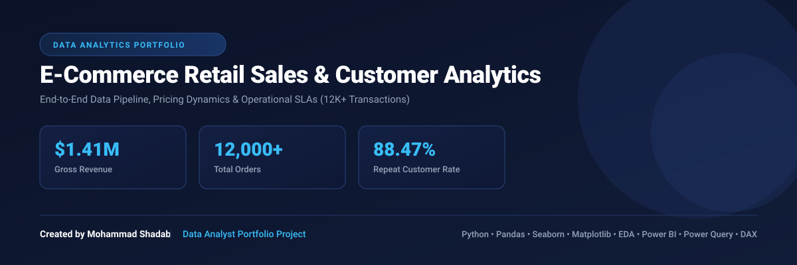

An end-to-end Data Analytics project analyzing over *12,000 retail transaction records* ($1.41M total gross revenue). This project covers complete data pipeline operations — from data cleaning, missing value imputation, and normalization to exploratory data analysis (EDA), statistical correlation, and executive storytelling through a presentation deck.

---

## 📌 Executive Summary & Key Performance Indicators (KPIs)

* *Total Gross Revenue:* $1,410,000 ($1.41M)
* *Total Orders Processed:* 12,000 (12.00K)
* *Average Order Value (AOV):* $117.38
* *Repeat Customer Rate:* 88.47% (Reflects strong customer brand equity)
* *Order Delivery Success Rate:* 54.82% (Operational bottleneck for fulfillment improvement)

---

## 🛠️ Data Pipeline & Engineering Methodology

1. *Missing Data Imputation:*
   * Imputed missing values in Discount Percent with 0 (assuming full-price purchase).
   * Imputed Shipping City with "Unknown" for incomplete location entries.
   * Filled missing Customer Rating using median strategy.
2. *Data Normalization & Standardization:*
   * Cleaned country names (e.g., mapped U.K., United Kingdom → UK).
   * Deduplicated transactional logs using Order ID.
3. *Feature Engineering:*
   * Calculated Total Sales (gross line-item value post-discount).
   * Derived date features: Year, Month, Quarter, and Day of Week for seasonal trend evaluation.

---

## 📊 Key Analytics Insights & Visual Storytelling

### 1. Monthly & Yearly Sales Performance
* *Trend Analysis:* Baseline revenue remains stable across years, with sharp seasonal spikes occurring during *Q4 (November & December)*.
* *Partial Data Flag:* Observed a temporary sales dip in August 2026 due to partial month data capture.

### 2. Category Revenue Engines
* *Top Drivers:* *Electronics* ($376K+) and *Home & Kitchen* ($275K+) drive over *45%* of gross retail sales.
* *Low Performers:* Grocery and Books demonstrate low revenue contributions despite steady order volumes.

### 3. Geographical Reach & City Hubs
* *Country Revenue:* Balanced distribution across major international markets (~$175K–$200K per country across UAE, UK, Germany, India, USA, Canada, and Australia).
* *City High-Performers:* Middle East hubs lead city metrics — *Abu Dhabi ($106K+)* and *Dubai ($92K+)* generate the highest individual city revenues.

### 4. Pricing Behavior & Revenue Dynamics (Scatter Analysis)
* *Linear Scaling:* Revenue expands linearly with Unit Price ($0–$250), validating high-unit-value catalog items as core revenue drivers.
* *Return Anomalies:* Identified negative total amounts ($0 to -$200) reflecting order refunds and returned goods.

### 5. Fulfillment & Operations
* *Delivery Status:* *54.82%* of total orders successfully delivered. High volumes in Shipped, Pending, Cancelled, and Returned indicate courier SLA bottlenecks.
* *Payment Gateways:* Uniform adoption (~15%–17% split) across Cash on Delivery, Netbanking, Credit/Debit Cards, Paypal, and UPI.

---

## 📈 Power BI Dashboard

*Interactive executive dashboards built in Power BI for deep-dive business intelligence.*

### 01 Executive Overview Dashboard

### 02 Operational Deep Dive & Action Insights

### 03 Time Series Trend Performance

### 04 Customer Demographics & Discount Impact Analysis

### 05 Customer Retention & Order Status Breakdown

---

## 🎯 Strategic Action Plan & Business Recommendations

| Area | Recommended Action | Expected Business Impact |
| :--- | :--- | :--- |
| *Demand Growth* | Increase Q4 inventory levels and marketing ad-spend by *40%* starting late September. | Capture Q4 holiday demand and prevent stockouts. |
| *Pricing & Bundling* | Shift away from blanket discounts (weak correlation of -0.07). Bundle low-performing items (Books/Grocery) with Electronics. | Maximize basket size and Average Order Value (AOV). |
| *Supply Chain* | Audit courier SLAs and establish local micro-fulfillment centers in top hubs (Abu Dhabi & Dubai). | Improve delivery fulfillment rates above 75% and lower transit times. |

---

## 📂 Project Repository Structure

<pre>
ecommerce-sales-customer-analysis/
│
├── Clean Data/                   # Cleaned and processed dataset
├── Images/                       # High-resolution saved charts & visualizations
├── Notebook/                     # Jupyter Notebook with complete Python code & EDA
├── Persentation/                 # 10-Slide Executive PDF Presentation Deck
├── Power BI Dashboard/           # Power BI dashboard exports (PNG & PDF)
├── Raw Data/                     # Raw transactional dataset
└── README.md                     # Project documentation & summary
</pre>

## 👤 Author & Contact Details

*Created by:* Mohammad Shadab
Data Analyst

Let's connect and discuss data analytics, business intelligence, and opportunities!

* 📧 *Email:* [jrshadab921@gmail.com](mailto:jrshadab921@gmail.com)
* 💼 *LinkedIn:* [Mohammad Shadab](https://www.linkedin.com/in/mohammad-shadab-550aab24b)
* 🐙 *GitHub:* [Mohammadshadab1](https://github.com/Mohammadshadab1)
* 🌐 *Portfolio:* [Mohammad Shadab Portfolio](https://myportfoliowebsite-lyart.vercel.app/)
* 📊 *Presentation Deck:* [View Executive PDF Deck](./Persentation/Presentation.pdf)

---
Created with ❤️ by Mohammad Shadab
